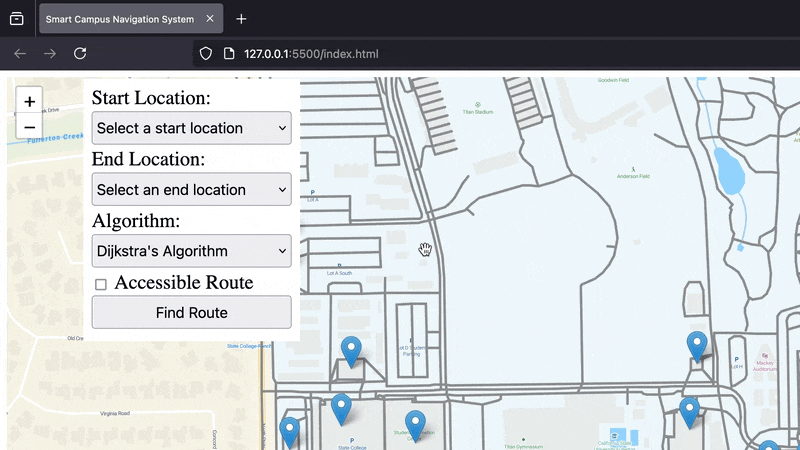

# 🏫 Campus Navigation System 📍

A web-based navigation tool for a university campus that uses **BFS (Breadth-First Search)**, **DFS (Depth-First Search)**, and **Dijkstra’s Algorithm** to compute paths between campus locations. The project features an interactive map (powered by **Leaflet.js**) and a data processing script (in **Python**) that converts GeoJSON data into a graph of nodes and edges.

## Table of Contents
- [Features](#-features)
- [Project Structure](#project-structure)
- [Technologies Used](#%EF%B8%8F-technologies-used)
- [Setup and Installation](#setup-and-installation)
- [Usage](#usage)
  - [Live Demo](#live-demo)
- [Future Enhancements](#future-enhancements)
- [License](#license)
- [Acknowledgments](#acknowledgments)

---

## ✨ Features

1. **Interactive Map Interface**  
   - Users can view a campus map with clickable or selectable buildings and pathways.

2. **Multiple Pathfinding Algorithms**  
   - **BFS:** Finds the path by exploring all nodes at each depth before moving deeper (shortest path in terms of number of edges on an unweighted graph).  
   - **DFS:** Explores as far as possible along each branch (not guaranteed shortest route).  
   - **Dijkstra’s Algorithm:** Computes the shortest path based on distances (weighted edges), suitable for real distances on campus.

3. **Data Processing with Python**  
   - Converts campus GeoJSON data into a graph representation (`campus_nodes_edges.json`) including node coordinates, edges, and distances.

4. **Validation Checks**  
   - Ensures users select valid start/end locations and an algorithm before computing routes.  
   - Prevents identical start/end choices.

5. **Modular Codebase**  
   - **`algorithms.js`** for pathfinding logic.
   - **`graph.js`** for managing the graph data structure (nodes and adjacency lists).
   - **`app.js`** for main application flow, map initialization, and UI event handling.  
   - **`process_geojson.py`** for data processing.

---

## Project Structure

```
campus-navigation/
├── index.html              # Main HTML file for the user interface
├── css/
│   └── styles.css          # Custom CSS for the UI
├── js/
│   ├── algorithms.js       # Contains BFS, DFS, and Dijkstra implementations
│   ├── graph.js            # Graph class / data structure handling
│   └── app.js              # Main application logic, map setup, event handlers
├── data/
│   └── data.geojson        # Original campus GeoJSON data
├── campus_nodes_edges.json # Generated file with processed nodes and edges
├── process_geojson.py      # Python script to convert data.geojson -> campus_nodes_edges.json
└── README.md               # This README file
```

---

## 🛠️ Technologies Used

- **Front-End:**
  - **HTML5**, **CSS3**, **JavaScript**
  - **Leaflet.js** for map visualization

- **Back-End / Data Processing:**
  - **Python 3** with a custom script (`process_geojson.py`) for generating graph data from GeoJSON

- **Algorithms:**
  - **BFS** (Breadth-First Search)
  - **DFS** (Depth-First Search)
  - **Dijkstra’s Algorithm**

---

## Setup and Installation

1. **Clone the Repository:**

   ```bash
   git clone https://github.com/YourUsername/campus-navigation.git
   cd campus-navigation
   ```

2. **Serve the Application Locally:**  
   - You can use a local server (e.g., Python’s built-in server) to serve `index.html`:
     ```bash
     python -m http.server 8000
     ```
   - Then open `http://localhost:8000/index.html` in your web browser.

---

## Usage

1. **Select Start and End Locations:**
   - Use the dropdown menus under **Start Location** and **End Location**.  
   - Ensure these are different (the app will show an error if they’re the same).

2. **Choose an Algorithm:**
   - **BFS**: Explores nodes in layers; good for unweighted graphs but ignores real distances.  
   - **DFS**: Explores a single path deeply; not guaranteed shortest.  
   - **Dijkstra’s**: Considers distances and finds the true shortest path on weighted graphs.

3. **Click **Find Route**:**
   - The app calculates the route using your chosen algorithm.  
   - A polyline is drawn on the map indicating the path.

### Live Demo
Here's a quick GIF demonstrating the main workflow:


---

## Future Enhancements

- **Display Path Statistics:**
  - Show total distance traveled and estimated walking time on the UI.
- **Accessibility Features:**
  - Indicate wheelchair-accessible routes or building entrances.
- **Real-Time Updates:**
  - Handle temporary blockages or construction routes.

---

## License

This project is licensed under the [MIT License](LICENSE.md) - see the `LICENSE.md` file for details.

---

## Acknowledgments

- **Leaflet.js:** For the interactive map components.  
- **OpenStreetMap & GeoJSON:** For geospatial data formats.  
- **Instructors & Peers:** For guidance and feedback on BFS, DFS, and Dijkstra’s implementations.

---

**Thank you for checking out the Campus Navigation System!**  
If you have any questions or suggestions, feel free to open an issue or submit a pull request on GitHub.
